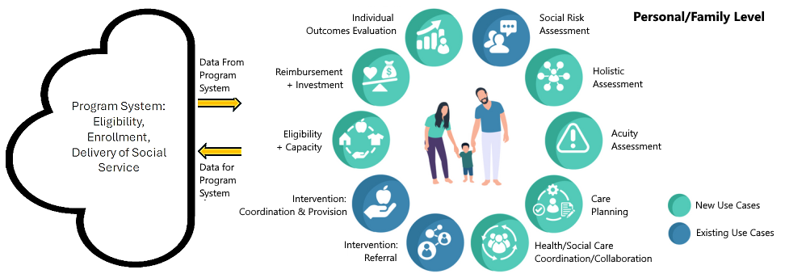

The Enhancing FHIR to Address Social Services and Social Determinants Project seeks to extend the use of FHIR to effectively and efficiently support Social Services. The HL7 Gravity Accelerator Program has done significant work in the context of social domains. This guide leverages their work and is a Companion Guide to the Gravity Project’s SDOH Clinical Care 2.1 Implementation Guide.

FHIR has proven its ability to deliver clinical applications using a Patient-Centric perspective. The US Department for the Administration of Children and Families (ACF), Gravity Pilot Projects, and other initiatives have been developing FHIR-based systems that include the capability to coordinate and manage care that also includes addressing social conditions and social service interventions. This is the most important goal of this Companion Guide, enhancing FHIR to deliver Whole Person Care (WPC).

Whole Person Care provides a view of an individual’s clinical, behavioral, and social needs and their support network. It is becoming increasingly accepted that these needs must be addressed together to promote well-being and healthy outcomes. Enhancing the FHIR Platform to address social services enables FHIR to incorporate the specific requirements of social services and  Whole Person Care (WPC) into the standard.

ACF and other federal, state, and local agencies and jurisdictions are using FHIR-based systems to assist in delivering better outcomes for their populations by addressing Social Determinant (SD) factors with appropriate and qualified human and social services. These organizations have found that FHIR needs to be improved to provide complete solutions when working with individuals who need social services and with organizations that provide those social services that can improve health outcomes but are not atypical healthcare systems.

This project objective is to reduce the barriers faced to effectively and efficiently delivering FHIR-based systems that incorporate Whole Person Care social services and social determinants to improve health outcomes.

This Companion Guide is developed by the HHS Working Group whose mission is “to provide a space for human services sector stakeholders and HL7 experts that focus on non-clinically oriented social risks and needs to define requirements, design, and validate HL7 Implementation Guides for interoperable human services data exchange”. The project and this Companion Guide are focused on the U.S. environment, the basic constructs and interaction patterns may well be applicable outside the U.S. realm.

Enhancing FHIR for Social Services Companion Guide is not meant to be an exhaustive closed loop referral standard between a Community Based Organization (or similar Social Services actor) and a Program (such as ACF’s TANF program, HUDs housing programs) or process standard. There is lots of work already being done and to be done to provide such a complete standard but it is beyond the scope of this IG. This IG will offers a framework in which such future follow-on work could be derived.

## Companion Guide Scope ##
The diagram below presents the new Gravity Conceptual Model (file:///C:/Users/Ken/Downloads/FINAL-Co-Design-Report-Gravity-Project-and-Civitas-Networks-for-Health%20(2).pdf) .

The diagram below illustrates the scope of this Companion Guide and how it augments the Gravity Conceptual Model in the SDOH Clinical Care Implementation Guide. To separate the concerns, the  Program System, on the left of the diagram, is responsible for enrollment in the social service(s).  The assumption has been made that the Program System may or may not be an FHIR-based system. To support this position, in the United States, over $400 billion of Social Services were delivered by just 3 separate Federal agencies in 2022  using non-FHIR Systems to address housing insecurity, food insecurity, and temporary financial security.

The system depicted on the right is a FHIR System that provides Whole Person Care. It represents the SDOH Clinical Care Implementation Guide.

The Program System depicted on the left may or may not be FHIR-based. The assumption has been made that it is not an FHIR-based system. To support this assumption, in the United States, just three federal agencies delivered over $400 billion of Social Services in 2022 using non-FHIR systems to address housing and food insecurity and temporary financial security.

## Dependencies on Other IGs ##
|Guidance Document |Version |Dependency |
|--- |--- |--- |
|Gravity SDOH Clinical Care Implementation Guide |2.1 |
|FHIR |Release 4.0.1 ||
|HL7 Domain Analysis Model: Patient Centered Care Team, |Release 1.0 |
|Others TBD ||

## How to Read This Guide ##

This IG contains material that may be new to the HL7 Community. Additionally, some sections are more applicable to participants in social services, while others provide detailed technical information targeted at implementors. The table below provides a listing of the key sections of the IG with recommendations to the order that they should be read.

|Section|Description|Audience|
|---|---|---|
Glossary |List of terms used in this guide and a definition of the term. The terms may have meanings specific to Social Services domains or their use in this Guide. |General
Background |The approach we developed to evaluate our the material in this guide as well as what is considered in scope and out-of-scope |General
Use Cases |The work product developed is driven by Use Cases. Two representative Use Cases are provided to provide context for the technical material |General
Guidance – Design and Evaluation |To meet the objective of providing recommendations for Enhancing FHIR, this section introduces the various designs for potential enhancements that were evaluated. |General
Guidance - Implementor |Based on requirements, this presents a Social Services Domain Analysis Model (SS DAM) |Technical 
FHIR Analysis Model |The FHIR compliant model that represents a FHIR implementation of of SS DAM |Technical
FHIR Realization Model |The recommendation of the FHIR Resources, Profiles, and Extensions for the a version of FHIR R5 |Technical
Artifacts |Specifications for FHIR Resources, Profiles, and Extensions contained in the FHIR Realization Model |Technical
Artifacts – Downloads |Examples of persona data for Use cases for FHIR Realization Model |Technical|
